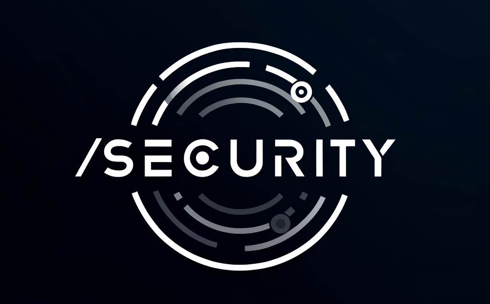
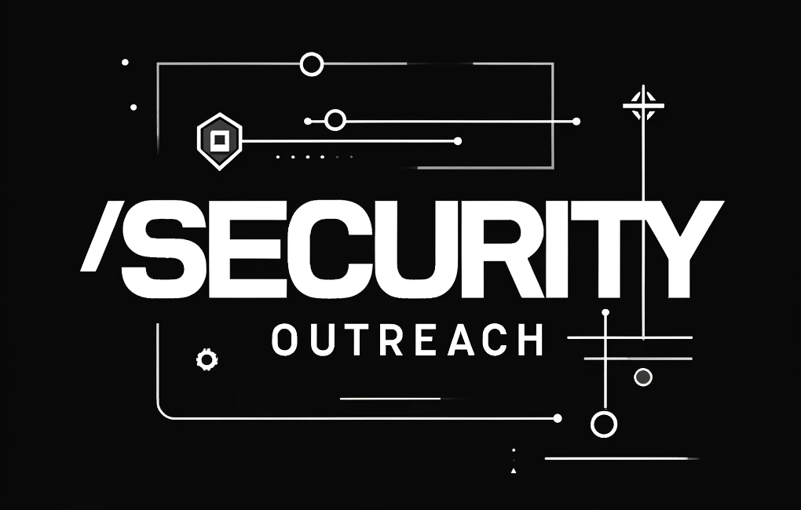

# Welcome to `/security`

This repository houses references, artifacts, and deliverables from, `/security` (slash security), operated by Amulet.  The [Interchain Foundation engaged Amulet](https://medium.com/the-interchain-foundation/amulet-strengthening-security-across-the-interchain-fa4b0bafadb4) to administer the Cosmos Bug Bounty program and engage in Security Coordination and Incident Response efforts for the Interchain Stack.

## Programs

### Bug Bounty

As part of our coordinated vulnerability dislcosure policy, we offer a Safe Harbor to all security researchers who work with us in good faith.  Please visit our Bug Bounty program at [https://hackerone.com/cosmos](https://hackerone.com/cosmos) to learn more, and to report any Security issues you may discover in the Interchain Stack.

Additionally, the @security alias at [security@interchain.io](mailto:security@interchain.io) is continuously monitored for security coordination.

### Security Outreach

You may have run across one of our advisories while working in the Interchain Stack. To see a complete list of all public advisories, see [ADVISORIES.md](ADVISORIES.md).

If you want to be notified of future advisories as they are released, please sign up [here](https://interchaincirt.org/signup).

For information about our current signing identities and validating artifacts, please see [SIGNING_IDENTITIES.md](./SIGNING_IDENTITIES.md).
