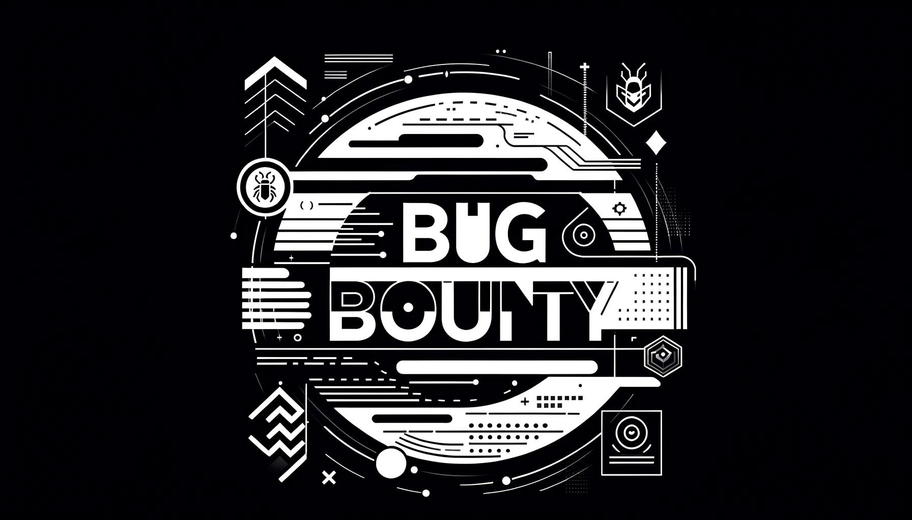

# Welcome to `/security`

This repository houses references, artifacts, and deliverables from, `/security` (slash security).

## Programs

### Bug Bounty

As part of our coordinated vulnerability dislcosure policy, we offer a Safe Harbor to all security researchers who work with us in good faith. Please visit our Bug Bounty program at [https://hackerone.com/cosmos](https://hackerone.com/cosmos) to learn more, and to report any Security issues you may discover in the Interchain Stack.

Additionally, the @security alias at [security@interchain.io](mailto:security@interchain.io) is continuously monitored for security coordination.

### Security Outreach

You may have run across one of our advisories while working in the Interchain Stack. To see a complete list of all public advisories, see [ADVISORIES.md](ADVISORIES.md).

Our team will also post public resources about security topics in the [resources](./resources) folder.

For information about our current signing identities and validating artifacts, please see [SIGNING_IDENTITIES.md](./SIGNING_IDENTITIES.md).
