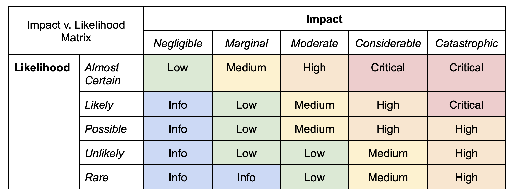

# Severity Classification Framework

## Criticality Matrix ACMv1

## Why Impact vs Likelihood

Using a framework such as the Impact vs. Likelihood matrix to bucket risk into five main categories: critical, high, medium, low, and informational, is an efficient way to communicate relative risk to other parties.

### Subjectivity and Contextualization

Unlike some complex risk assessment models, including CVSS, the Impact vs. Likelihood framework allows for a degree of subjectivity and contextualization. Engineers can tailor the assessment criteria to suit their specific needs and factors relevant to their operations. This flexibility enhances relevance and usefulness in various environments.

### Prioritization of Resources

By classifying risks based on their impact and likelihood, teams can allocate resources to address the most critical risks first. This approach enables them to focus on mitigating potential high-impact, high-likelihood risks, thereby minimizing their overall risk exposure.

### Quantitative and Qualitative

An Impact vs. Likelihood framework can be used in quantitative and qualitative risk assessments. While some teams may assign numerical values to impact and likelihood, others may use descriptive scales (e.g., low, medium, high). This adaptability applies to various teams with varying risk management maturity levels.

## Topics to consider when determining risk

### Availability

Evaluate the impact on the availability of the chain. Will the vulnerability lead to service disruptions, downtime, or denial of service? Consider the potential financial losses, reputational damage, and operational impacts of unavailable resources of the chain. Across the affected chains, how important is liveness to the affected groups?

### Recoverability

Analyze the ease and speed of recovery from exploiting the vulnerability. How quickly can the system or service be restored to regular operation? Assess the resources and efforts required for recovery and the impact on business continuity.

### Confidentiality

Determine if the vulnerability compromises sensitive information or data. Assess the potential damage if unauthorized parties gain access to sensitive data, including financial losses, legal consequences, and harm to customer trust. This area is less important in our space but may be critical for privacy-focused chains.

### Integrity

Consider the impact on data integrity if the vulnerability allows unauthorized modification or alteration of critical information. This may result in misinformation, data corruption, and potential legal or compliance issues.

### Authentication and Authorization Bypass

Evaluate if the vulnerability can lead to unauthorized access to privileged wallets or systems. Unauthorized access can enable attackers to gain control over critical assets or escalate their privileges, potentially leading to severe consequences.

### Data Loss

Determine if the vulnerability can result in data loss. Losing critical data can have significant financial, operational, and legal ramifications.

### Exploitation Complexity

Assess how difficult it is for an attacker to exploit the vulnerability. If the exploitation is straightforward, the risk is higher than a vulnerability requiring complex, sophisticated techniques. Does successful exploitation require governance or leave other noisy artifacts that could be detected?

### Scope

Consider the scope of the impact. Does the vulnerability affect a single system, multiple systems, or the entire chain or ecosystem?

### Regulatory and Compliance

Evaluate whether the vulnerability could result in non-compliance with relevant regulations or industry standards. Non-compliance may lead to penalties, legal actions, and reputational damage. Depending on the current regulatory environment, this may be more or less relevant (e.g., banned addresses, OFAC compliance, etc.)

### Dependencies and Interconnections

Examine the potential ripple effects of the vulnerability on interconnected systems or third-party services. One vulnerability could have cascading effects on various parts of the infrastructure. A good example is the ics23 bug, where the impact was very much inter-chain.

### Patch Availability and Remediation Effort

Consider the availability of patches or mitigations to address the vulnerability. If limiting the availability of a patch is required to limit impact, consider the effect on chains unable to patch and consider the tradeoffs. Additionally, the impact may be substantially more significant depending on the difficulty or complexity of patching this issue. Assess the effort and time required to remediate the issue effectively.

### Threat Landscape

Analyze the current threat landscape and whether known active exploits target the vulnerability. The presence of active exploits increases the urgency of addressing the issue.

### Token Supply and Circulating Supply

Vesting and locking mechanisms can affect the token supply and circulation. Locked tokens are typically excluded from the circulating supply, impacting metrics like market capitalization and token liquidity. A vulnerability in one of these mechanisms may adversely affect a chain's tokenomics implementation, leading to price fluctuations and shifts in market perception.

### Mitigation mechanisms

Investing in mechanisms, including a circuit breaker for specific APIs, may reduce the impact of vulnerabilities to all chains. This type of feature is immensely beneficial for systemic risk reduction. Does a mechanism exist today that chains know how to use that could mitigate this risk efficiently?

## Examples

The below examples are rough estimations of general buckets some bugs can fall into.

- Critical bugs have a likely and catastrophic impact, which have cross-chain impact, and can include direct loss of funds, minting of arbitrary assets, trivial bypass of essential security function, etc.
- High bugs have a possible likelihood and critical impact, which have cross-chain impact, and can include a trivial denial of service resulting in a chain halt, indirect loss of funds, consensus issues, etc.
- Medium bugs have a possible likelihood and moderate impact, and affect specific chains using a module or feature, and can include application logic issues, accounting errors, etc.
- Low bugs have a possible likelihood, and marginal impact, and affects specific chains using a module or feature, and can include denial of service issues, application logic issues, error validation, etc.

[Security Classification Matrix](https://github.com/interchainio/security/blob/main/resources/CLASSIFICATION_MATRIX.md) © 2023 by Amulet is licensed under [CC BY-NC-SA 4.0](https://creativecommons.org/licenses/by-nc-sa/4.0/?ref=chooser-v1)
